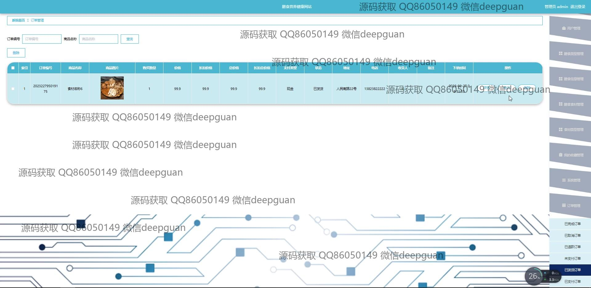

<h1 align="center">膳食营养健康网站</h1>

## 简介
膳食营养健康网站：角色分为管理员和用户；用户功能包括注册登录、个人信息管理、订单管理、膳食查询与建议；管理员功能涵盖用户管理、膳食管理、订单管理、系统设置，整体设计简洁，功能齐全。    --计算机毕业设计源码；毕设源码；java毕业设计源码

## 联系方式

<h3 align="center">获取完整代码与数据库文件 + 微信：deepguan QQ: 86050149 QQ群: 783742310</h3>

<h3 align="center">可帮忙远程部署 包运行成功！提供远程部署、修改代码、设计文档指导、代码讲解等服务！</h3>

## 功能介绍（完整见运行截图）
管理员：  
基本功能包括后台管理登录与系统设置。管理员可管理用户信息、膳食类型、营养成分和订单数据，通过导航栏访问用户管理、膳食管理、公告编辑等模块，还能进行系统公告发布和管理。订单管理提供订单详情查询及处理，便于查看和更新订单状态。

用户：  
用户注册和登录可以更新个人信息如手机号、用户名和上传头像。个人中心提供查看和编辑个人账号功能。用户可浏览膳食信息及食材，使用导航栏访问订单和地址管理，进行在线下单及支付，通过购物车查看订单详情与价格，确认和备注订单。

网站设计与交互：  
网站采用简约设计风格，具有首页导航栏和视觉吸引力强的幻灯片展示，提供膳食信息、食材资讯、订单管理等功能模块。整体界面友好，便于用户操作，通过搜索框快速查找膳食或订单，增强用户体验与便捷性。

数据与内容管理：  
管理员通过左侧菜单进行数据录入和管理，支持按名称或类型搜索膳食信息、管理食材详情和价格，并在后台系统中管理膳食类型和营养成分。页面支持图文并茂的信息编辑和数据表格展示，实现系统高效数据维护和信息更新。

## 运行截图

本代码来源于网络,仅供学习参考使用!

